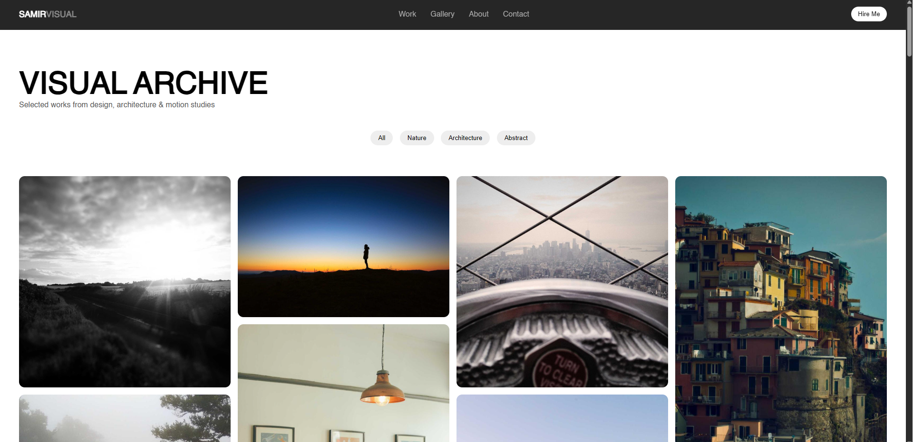
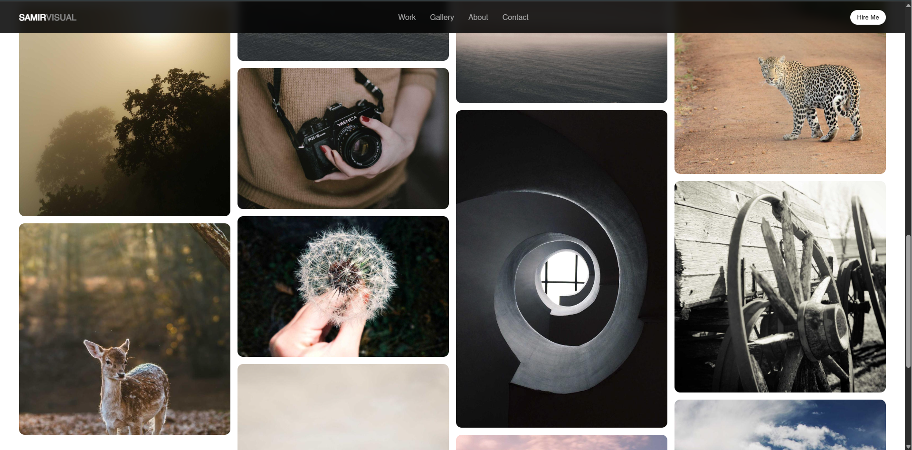
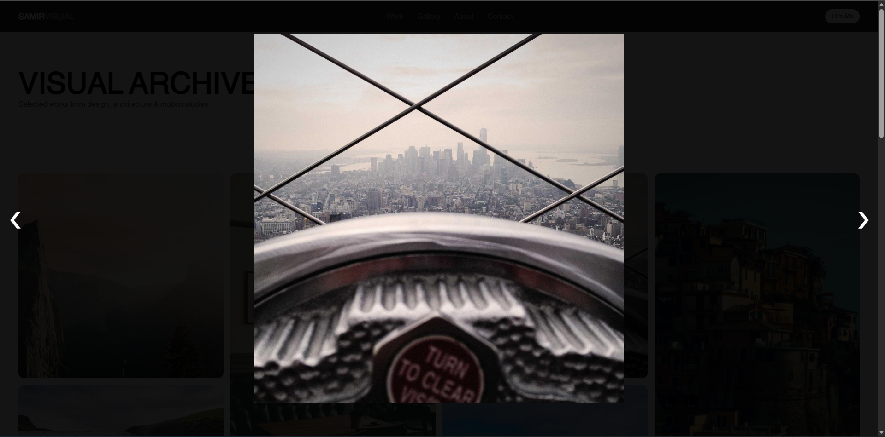

# ⚡ CodeAlpha Image Gallery

A modern, responsive image gallery web application built using **HTML, CSS, and JavaScript** as part of the CodeAlpha Frontend Development Internship.

---

## 📌 Project Overview

This project showcases a clean and responsive image gallery with a modern layout and smooth interactions.

---

## ✨ Features

- Responsive image grid layout  
- Lightbox image preview  
- Keyboard navigation support  
- Hover zoom effects  
- Clean UI design  

---

## 🛠️ Tech Stack

- HTML5  
- CSS3  
- JavaScript (Vanilla JS)

---

## 📷 Preview

  
  

---

## 👨‍💻 Developer

Samir Pratap Singh Verma